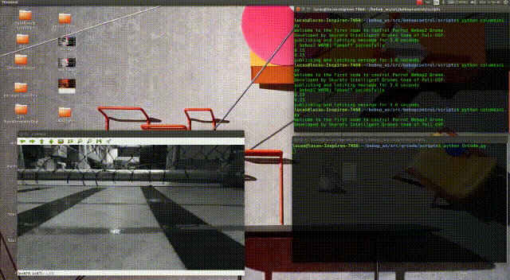

# bebop_ws
# Bebop ROS Workspace
This repository includes drone control and computational vision applications.
It supposes you have installed the Robotic Operating System (ROS), OpenCV2, Pyzbar, Numpy and others dependences. 

# Setup the workspace on your PC

$ sudo apt-get install build-essential python-rosdep python-catkin-tools

### Get the repository

$ git clone https://github.com/lucaspenna00/bebop_ws/

### Create and initialize the workspace
$ cd ~/bebop_ws

### Update rosdep database and install dependencies (including parrot_arsdk)
$ rosdep update
$ rosdep install --from-paths src -i

### Build the workspace
$ catkin build

# Running Workspace applications

Firstly, you need to run the Bebop ROS drive (in order to run all others applications)

### Run the drive

$ roslaunch bebop_driver bebop_node.launch

### Useful ROS commands

All the topics disponible on BEBOP_DRIVE:

$ rosmsg list

Message details:

$ rosmsg show [TOPIC_NAME]

Message type via ROS topic:

$ rostopic type [TOPIC_NAME]

See the Bebop camera image:

$ rosrun rqt_image_view rqt_image_view --force-discover

More information:
https://bebop-autonomy.readthedocs.io/en/latest/
